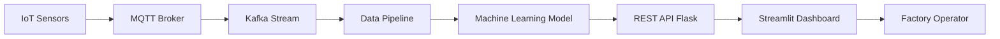

# Data-Analysis
Data Science Projects Using Python and a little R. 

This repository is a place to share my code and notebooks for numerous data science projects.

Many of these projects are written up on my [Towards Data Science Medium page](https://medium.com/@williamkoehrsen). 

Reach me on Twitter [@koehrsen_will](https://twitter.com/@koehrsen_will)

## Industrial AI Architecture

